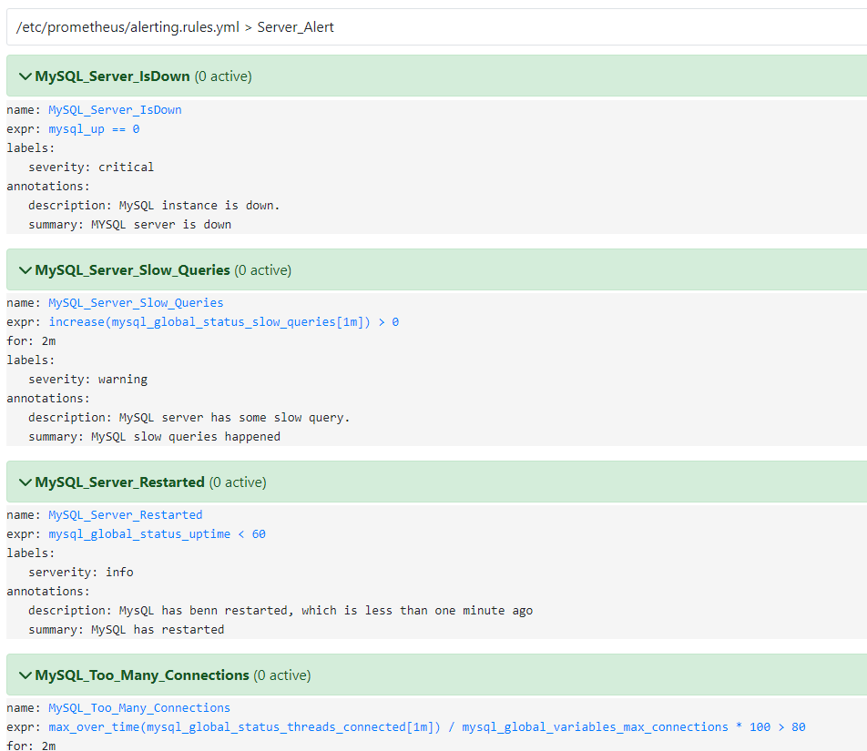

# Database Security

A Database Security Project develops a series of security mechanisms for Authentication, Authorization and Monitoring.


## Demo Video

[Demo Video
](https://youtu.be/r8lTMOQPO8c)


## Installation

Clone the git repository

```bash
  git clone https://github.com/tonglo31/db_security.git
```
## Setup Docker Container

```bash
cd docker-compose up --build
```
The LAMP stack, monitoring tools and dashboard should now setup successfully.

## If the dashboard does not import successfully
Import the dashboard manually by JSON file.

Download Grafana MySQL dashboard [Type I
](https://github.com/tonglo31/db_security/releases/tag/grafana) [Type II](https://github.com/tonglo31/Summary/releases/tag/0.1)

```bash
localhost:3000 -> Dashboard -> import json file
```
Download Kibana dashboard [link](https://github.com/tonglo31/db_security/releases/tag/1.0)

```bash
localhost:5601 -> Search saved object -> import ndjson file
```




## Setup filebeat
If want to make audit.log as JSON format
```bash
vi/using editor uncomment line 16 of docker-compose.yml
docker-compose up -d --no-deps --build db
```

```bash
docker exec -it filebeat bash
cd /usr/share/filebeat 
filebeat setup -e
```
The filebeat should be setup successfully.

##Demo Part1: Client Side
Test the following
1. Go to localhost
2. Registration and Login 
3. Enable 2FA authentication

##Demo Part2: Database Access Control &&  Account Locking
###1. Show created user
```bash
docker exec -it mysql bash
mysql -u root -p
secret
SELECT HOST, user FROM mysql.user;
```
###2. Show granted permission
```bash
SHOW GRANTS FOR {USER};
```
###3. Test the granted permission
```bash
mysql -u csstaff -p
csstaff
select * from lamp_docker.artwork;
select * from lamp_docker.verification;
exit
```
###4. Failed-Login Tracking
Default pw is: databaseadmin
Now try more than three attempts at error logins. 
```bash
mysql -u databaseadmin -p
```
Account should be suspended

##Demo Part3 & 4: Logging & Server monitoring/Alerting
###1. Check if the log exist
```bash
docker exec -it mysql bash
ls /var/log/mysql
cat /var/log/mysql/{logfile_name}
```
###2. Generate Some Slow Query/Shutdown MySQL server
```bash
execute SQL query: SELECT sleep(15);
docker container kill db/docker container stop db
```

###3. Dashboard 
1. Checking Dashboard & Alerting Rules

Kibana Dashboard: http://localhost:5601/ 
```bash
Search Saved Objects
Select [Filebeat MySQL] Audit_ErrorLog_MySQL
```

Prometheus Alerting Rules: http://localhost:9090 
```bash
Select Alerts
```

Grafana Dashboard: http://localhost:3000
```bash
Dashboard
Browse
Select MySQL Monitoring
```
